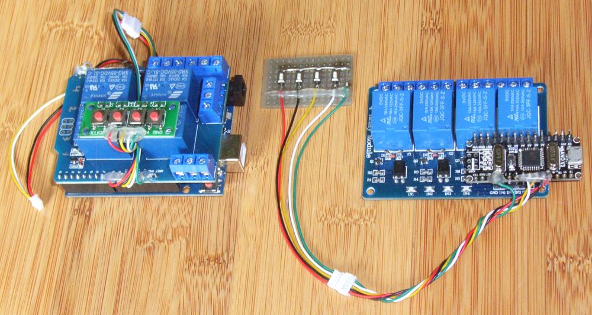

# ConradRelayEmu
DIY version of the widely used "Conrad relay card", where the communication protocol is emulated with an Arduino.

The relays can be assigned freely to any Arduino GPIO; either high-active or low-active. In addition to the genuine relay card, pushbuttons can also be attached to toggle the relays manually.

## Genuine relay card
www.conrad.de - Item Number 197720 
https://www.conrad.com/search?search=197720
